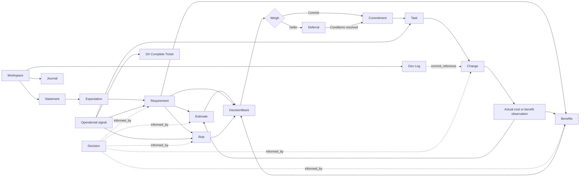

# DX Complete Model

## Current Model

The model is a full DX lifecycle, not merely a software development workflow.

It includes cost and benefit reasoning before engineering begins, both build/change roles and run/service roles, and actual measurement after delivery where available.

The current runtime scope decision is `Workspace`: the hosted-record container for one service scope. The default MCP deployment model is one endpoint per workspace. Each installed project repo carries its workspace identity in editable DX Complete config and exposes one MCP route for that workspace.

Workspace MCP deployments are not database runtimes and do not install the hosted DX Complete service. They proxy auth and MCP requests to that service. The hosted service owns database access, OAuth exchange, workspace membership, readable-ID allocation, and MCP tool execution. Separate database deployment may be revisited later, but workspace servers should not hold database credentials in the current model.

Workspace carries the service identity through its name, summary, and mode when useful. A separate service charter record is not part of the current model; if a presentation summary is needed, it should be derived from the workspace and current expectations.

The current decision-basis model is that `Statement`, `Expectation`, `Requirement`, `Estimate`, `Benefits`, and `Decision` sit upstream of Build inside the Workspace. Statements, expectations, dependencies, constraints, unknowns, and requirements should be elicited before useful estimates are generated. Current-state cost context should be attempted where relevant, an itemized cost `Estimate` should be generated by default from the elicited requirement set where cost reasoning is needed, expected `Benefits` should be recorded where possible, and Weigh should bridge into Build through a Commitment or keep the path visible through a Deferral. A Decision can preserve ordered rationale entries and records that informed the Owner's judgment.

The current early lifecycle is `Statement -> Expectation -> Requirement -> Commitment`, with `Deferral` as the alternate Weigh outcome that can resolve into a Commitment. `Statement` preserves the user's own words before interpretation as a runtime record. `Expectation` is tracked as a runtime record and restates the expected result and how success will be recognized in user-facing language. The MCP client should confirm captured wording before recording it on a user's behalf. Separate authority approval, usually by Owner, can be tracked when it reduces risk. `Requirement` is the team-owned commitment that translates expectations into something buildable and verifiable. Statements, expectations, and requirements should keep prior versions when their current wording changes. `Commitment` records the Owner moving requirements or expectations into Build. `Task` is a cross-cutting execution object that can be created whenever a phase needs concrete action. `Journal` is cross-cutting shared workspace context for relevant notes that do not have a dedicated record home. `Dev Log` is internal code-history context for workspace repository commits.

A separate technical specification object is not part of the current model. Implementation and verification detail should live inside a Requirement as optional requirement detail until the need for an independent object is proven.

The current engineering lifecycle uses `Requirement` as the main end-to-end engineering object. Requirements are shaped during elicitation, committed or deferred during Weigh, and refined into requirement detail and tasks during Build once covered by a Commitment. Task is the internal work-order record: it has ordered entries, a current status derived from the latest status-change entry, and optional assignment by role, by named person, or by assignor. Unassigned Tasks remain valid when responsibility is not settled. Dev Log records what landed in the workspace repository and can match Change commit references by hash; it does not make every commit a Change. The Engineer works primarily on Tasks and may use coding-capable tools such as Codex where appropriate. Incident and Problem are run-side records: Incident records a specific service-impacting occurrence, and Problem records an underlying or recurring cause evidenced by incidents. Feature Request, Feedback, Authoritative Request, Release, Deployment, and Control remain useful lifecycle concepts, but they are not separate runtime records in the current model.

Engineer input on Expectations or Requirements is preserved as append-only free text. A review note can be marked important to draw attention, but it does not block progress, create a severity state, or require an Owner response.

Approval and similar confirmation points are advisory risk checkpoints, not blockers. A checkpoint can be approved, formally accepted as risk by the Owner, or proceeded past with the open risk still visible. Proceeding past an open checkpoint does not close or accept the risk.

DX Complete preserves the matter being decided, ordered decision entries, loose argument and note entries, and the records that informed the choice. The current decision is derived from the latest decision entry while earlier decisions remain visible. DX Complete does not require numeric weights or attempt to prove that the decision was objectively correct. Authority can make a poor or unreasonable decision; the system's role is to keep the decision trail visible for accountability, review, audit, and learning.

## Model Layers

Direction sets authority, priority, boundaries, and escalation paths.

Workspace scope contains one service context and prevents records from different service scopes from mixing in the hosted record store. In the hosted model, the endpoint gets workspace scope from repo config, then the hosted DX Complete service checks the authenticated actor identity and workspace authorization before executing tools.

Decision-basis work captures the initial statement and expected outcome, elicits expectations, requirements, and enough detail for useful estimates, attempts current-state cost visibility where relevant, estimates projected cost through `Estimate`, records expected value through `Benefits`, and supports Weigh. `Estimate` is the structured itemized cost record for Weigh. `Benefits` is the Owner-authored benefit record and may include quantified or qualitative benefit items. Decision records preserve rationale and linked inputs when a separate decision trail is useful.

Weigh records the Owner outcome: a Commitment that moves work into Build, or a Deferral that records unmet conditions.

Product definition converts needs, feedback, and authoritative requests into desired outcomes and requirements.

Engineering execution refines committed requirements into requirement detail where needed and decomposes work into tasks.

Engineer implementation performs task work directly or by driving coding-capable tools. Codex may assist as a coding-capable model, but Codex is not itself a role.

QA verification checks whether the work satisfies requirements and acceptance criteria.

Product validation checks whether the verified result is the right product outcome.

Change and release control records the service change, change type, readiness basis, notice, vetoes, result, and recovery where needed.

Deployment and operation release, monitor, and run the service safely.

`Change` is the current run-side control record for a discrete, time-bound alteration to the running service. It is not a standing Operations Plan. A Change keeps baseline sections for change type, change plan, execution steps, rollback plan, and risk or impact, including downstream impact where known: what else may be affected and what depends on what is changing. It then records notice, veto, decision, result, recovery, notes, and plan revisions as append-only events. Result and recovery events may include optional Git commit references for point-in-time traceability. DX Complete stores those references as provided; it does not call Git, validate commits, or assume a specific Git host. Emergency is a Change type, not a separate event path. DX Complete records the accountability trail; it does not perform or enforce the operation.

Support Agent work handles user-facing issues and routes signals into Owner or Operator follow-up.

Operator administration manages users, permissions, configuration, and governance setup.

Audit and evidence captures decisions, controls, releases, deployments, approvals, and verification results.

Operations measurement captures actual cost and benefit observations where available and feeds future estimate refinement.

Decision rationale captures ordered entries for the matter being decided, including decision entries, argument entries, and notes without forcing those arguments into weighted or directional scoring. Decision inputs link the Decision to the records that informed it, so the trail can be followed from the choice back to its basis.

Resolution records formal authority. Pending records are Motions; passed records are Resolutions. Resolution is separate from Decision and Commitment: it records whether authority exists, while Decision records a choice among alternatives and Commitment records the Owner moving weighed scope into Build. Resolutions can be cited by other records through authority links, but the presence or absence of a Resolution does not block other records or work.

## Relationship Shape

## Adaptation Principle

Keep the workspace process files editable. If a team makes a local policy decision that changes how it uses `Change`, `Requirement`, or another record, update the Markdown, YAML, and Mermaid files together so the workspace guidance stays consistent.
